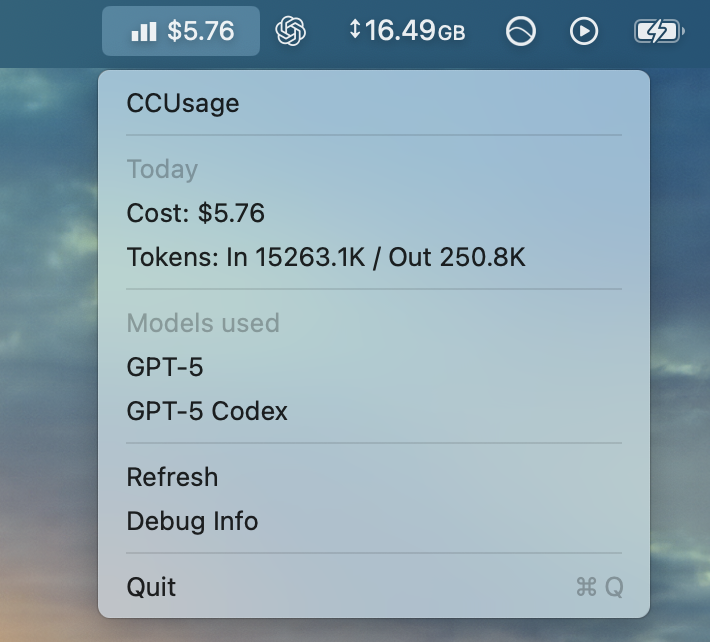

# ccusage-macos-menubar

Small macOS menubar wrapping the [ccusage CLI](https://github.com/ryoppippi/ccusage) to show usage of the current Claude Code 5hr session.

Menubar data will auto-refresh every 2 minutes in the background, or you can manually hit "refresh".

Built with [Tauri](https://v2.tauri.app/).
