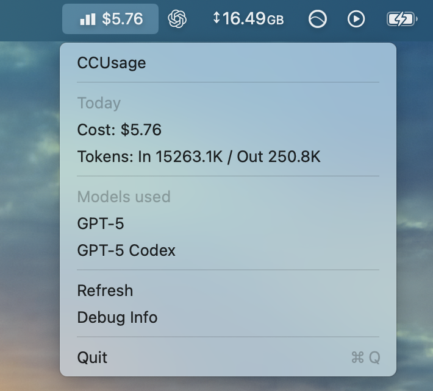

# ccusage-macos-menubar

## [Download](https://github.com/voctory/ccusage-macos-menubar/releases)

**Forked from https://github.com/6/ccusage-macos-menubar to use @ccusage/codex**

Small macOS menubar wrapping the [ccusage CLI](https://github.com/ryoppippi/ccusage) via the `@ccusage/codex` package to show today's local Codex usage and cost. (CLI and VS Code extension included).

Menubar data auto-refreshes every 2 minutes in the background, or you can manually hit "Refresh".

Example CLI used by the app:

```
npx @ccusage/codex@latest daily --json
```



Built with [Tauri](https://v2.tauri.app/).
